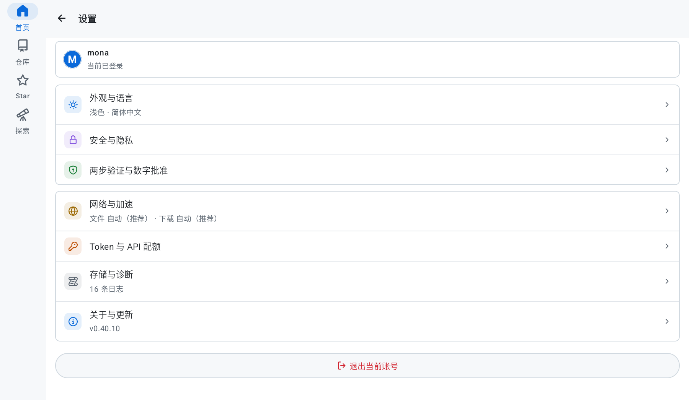

# MobileGH

MobileGH 是一款用 Kotlin 和 Jetpack Compose 构建的第三方 GitHub Android 客户端。你可以在手机上浏览仓库、阅读源码、审查 PR、处理通知，也能查看 Actions 日志和下载安装包。

简体中文 · [English](README.en.md) · [下载最新版](https://github.com/sheep-programmer/mobilegh/releases/latest) · [反馈问题](https://github.com/sheep-programmer/mobilegh/issues)

## 界面预览

截图取自 v0.40.11 的模拟器构建，使用虚构账号和本地测试数据。

<table>
  <tr>
    <td align="center"><br>首页</td>
    <td align="center"><br>仓库详情</td>
    <td align="center"><br>Issue 讨论</td>
  </tr>
  <tr>
    <td align="center"><br>分栏 Diff</td>
    <td align="center"><br>通知</td>
    <td align="center"><br>Actions 日志</td>
  </tr>
</table>

<details>
<summary>平板横屏与设置</summary>



</details>

## 下载与登录

支持 **Android 8.0（API 26）及以上**。v0.40.12 的 ARM64 主安装包和各架构校验值见最新 Release。 [Release 说明](docs/RELEASE_v0.40.12.md)

| 设备 | 安装包 |
| --- | --- |
| 大多数安卓手机和平板 | `app-arm64-v8a-release.apk` |
| 旧款 32 位 ARM 设备 | `app-armeabi-v7a-release.apk` |
| x86-64 设备或模拟器 | `app-x86_64-release.apk` |
| 不确定架构 | `app-universal-release.apk` |

每个 Release 附有 `SHA256SUMS.txt`。安装后可用 GitHub 授权登录，也可以使用个人访问令牌（PAT）。仓库操作取决于账号权限、授权范围和组织策略。 [下载页](https://github.com/sheep-programmer/mobilegh/releases/latest) · [认证与权限说明](docs/AUTH_CAPABILITIES.md)

## 主要功能

| 场景 | 在 MobileGH 中可以做什么 |
| --- | --- |
| 浏览仓库 | 原生阅读 README，使用目录跳转和图片缩放，查找源码、查看逐行归因，按时间、Star、Watch 或名称排列 Fork。 |
| 协作与审查 | 阅读和编辑 Issue、PR 与 Discussions，使用 Issue 模板、父子 Issue、Markdown 草稿、行内审查和代码建议。Diff 可切换统一或左右分栏，PR 文件已阅状态可与 GitHub 同步。 |
| Actions 与 Release | 查看 Job 和 Step、跳到失败步骤、搜索并导出日志，按权限触发或重跑工作流。可筛选 Release 附件、暂停和续传下载，并从 Actions 产物 ZIP 中选择 APK。 |
| 上传与仓库维护 | 编辑文件、创建分支、管理 Release。多选文件或文件夹可一次提交，超出 GitHub 普通文件限制时可使用 Git LFS。 |
| 日常收件箱 | 首页支持自定义快捷入口、Pin、Star 列表和收藏夹。通知可按仓库分组、多选处理，个人主页可查看贡献热力图。 |
| 账号与安全 | 支持多账号、应用锁和本地 TOTP 验证器。数字批准功能取决于 GitHub 账号的授权资格。 |
| 阅读和界面 | 支持中英文、深色模式、悬浮底栏及可选离线翻译。平板宽屏显示左侧导航，窗口缩窄后恢复底部导航。 |

### 离线翻译

默认关闭。在「设置 → 外观与语言 → 阅读」开启后，按提示下载并安装独立组件，再下载中英互译模型。模型通过完整性校验和双向试译后，开关才会开启。其他语言可按需下载。

开启后，页面右上角的「⋯」可在译文和原文之间切换。正文在设备上翻译，译文只在本次会话内存中缓存。独立组件及下载的语言模型保留在设备上，主安装包无需携带翻译引擎。

### 下载与更新

从首页右上角可随时打开下载记录。下载详情和记录面板可用右上角横线图标最小化，也可彻底关闭面板。任务和文件仍可从下载记录找回。GitHub 提供 SHA-256 的附件会在保存前校验。

应用内在线更新使用独立于普通下载的更新提示与进度界面，更新安装包下载完成后会自动拉起系统安装器。网络设置支持分别配置「文件与图片」和「下载与克隆」加速镜像。

## 构建与贡献

需要 JDK 17 或更高版本和 Android SDK 36。仓库包含 `app`（Kotlin、Compose UI 与 GitHub API）及 `translation-plugin`（可单独安装的离线翻译组件）。

```bash
./gradlew :app:assembleDebug
./gradlew :app:testDebugUnitTest
./gradlew :app:connectedDebugAndroidTest
./gradlew :app:assembleRelease :translation-plugin:assembleRelease
```

维护 Release 时，将 `translation-plugin/build/outputs/apk/release/translation-plugin-release.apk` 以 `mobilegh-offline-translation.apk` 的名称加入同一 Release。主包与组件须使用同一签名证书，GitHub Release 资产须提供 SHA-256 摘要。构建读取本地 `keystore.properties` 或 `MOBILEGH_*` 签名环境变量，缺少发布密钥时回退到调试签名。

可用 `tools/readme_screenshots.sh` 在专用模拟器上生成中英文截图。提交问题时请附版本号、Android 版本、复现步骤和截图。 [功能清单](docs/FEATURES.md) · [发布回归清单](docs/RELEASE_REGRESSION.md) · [提交 Issue](https://github.com/sheep-programmer/mobilegh/issues/new/choose)

## 许可证

MobileGH 项目自有代码采用 **GNU Lesser General Public License v3.0 或更高版本（`LGPL-3.0-or-later`）**。分发修改版本时须遵守许可证的源代码和通知要求。与其他代码链接使用时，适用 LGPL 的附加许可及其条件。 [LGPL 正文](LICENSE) · [GPL v3 基础条款](COPYING)

第三方代码、依赖和资源沿用各自的许可证或使用条款，包括可选翻译组件使用的 Google ML Kit。 [内置网页资源的第三方声明](app/src/main/assets/web/THIRD_PARTY_LICENSES.txt)
